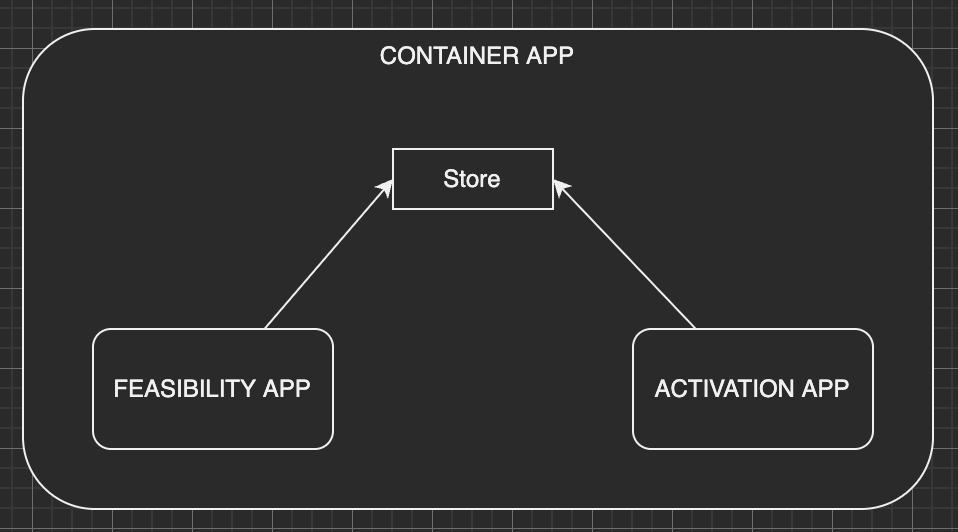

<!-- PROJECT TITLE -->
<br />
<div align="center">
  <h1 align="center">Module Federation + Webpack5</h1>
</div>

<!-- ABOUT THE PROJECT -->
## About The Project

This is a Proof of Concept Project. One app container with a store component and two independent apps inside the container sharing the same store. 

<div align="center">
  <a href="https://github.com/othneildrew/Best-README-Template">
    
  </a>
</div>

The global picture to get in the context

- Micro Frontends: The idea of micro frontends is to allow the benefits of microservices in the frontend world.
<br>There are 4 common ways to build micro frontends:
1. Integration via iFrames
2. Serverside composition
3. Build-time integration via components
4. Runtime integration (client-side composition)

The solution we are using in this project is <b>Module Federation</b> which belongs to the Runtime integration pattern of building micro frontend.

Why Module Federation? Is a feature from Webpack 5, absolutely free, framework-agnostic. 


<!-- GETTING STARTED -->
### Prerequisites

You need to have install in your pc node.js and npm
* Node.js https://nodejs.org/en/


## Getting Started

The repo is divided in 3 apps:
* activation
* container
* feasibility

We need to run those 3 apps separetely. Open 3 terminals in your Code Editor and be sure that you are in the main route of the project '02-Demo-ContainerModuleFederation'

First, let's run container app
- Change into: ``` cd container ```
- Install npm package and dependencies ``` npm i ```
- Start the project executing  ``` npm start ```
- It should be opened in port ```localhost:8080 ```

Second, let's run feasibility app
- Change into: ``` cd feasibility ```
- Install npm package and dependencies ``` npm i ```
- Start the project executing  ``` npm start ```
- It should be opened in port ```localhost:8081 ```

Thrid, let's run activation app 
- Change into: ``` cd activation ```
- Install npm package and dependencies ``` npm i ```
- Start the project executing  ``` npm start ```
- It should be opened in port ```localhost:8082 ```

<!-- ACKNOWLEDGMENTS -->
## Acknowledgments

* [Weback Module Federation](https://webpack.js.org/concepts/module-federation/)
* [Micro-Frontends Course](https://www.youtube.com/watch?v=lKKsjpH09dU)
* [State Management in Webpack](https://www.youtube.com/watch?v=njXeMeAu4Sg)
* [Micro Frontends with create-react-app](https://medium.com/nerd-for-tech/micro-front-ends-hands-on-project-63bd3327e162)
* [Ways to build Micro Frontends](https://codeburst.io/4-practical-ways-to-build-micro-frontends-4dc4f0b8a921)
* [Module Federation/Micro Frontends Mistakes](https://www.youtube.com/watch?v=0WIFW3s2fDM)

[React.js]: https://img.shields.io/badge/React-20232A?style=for-the-badge&logo=react&logoColor=61DAFB
